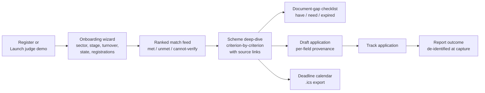
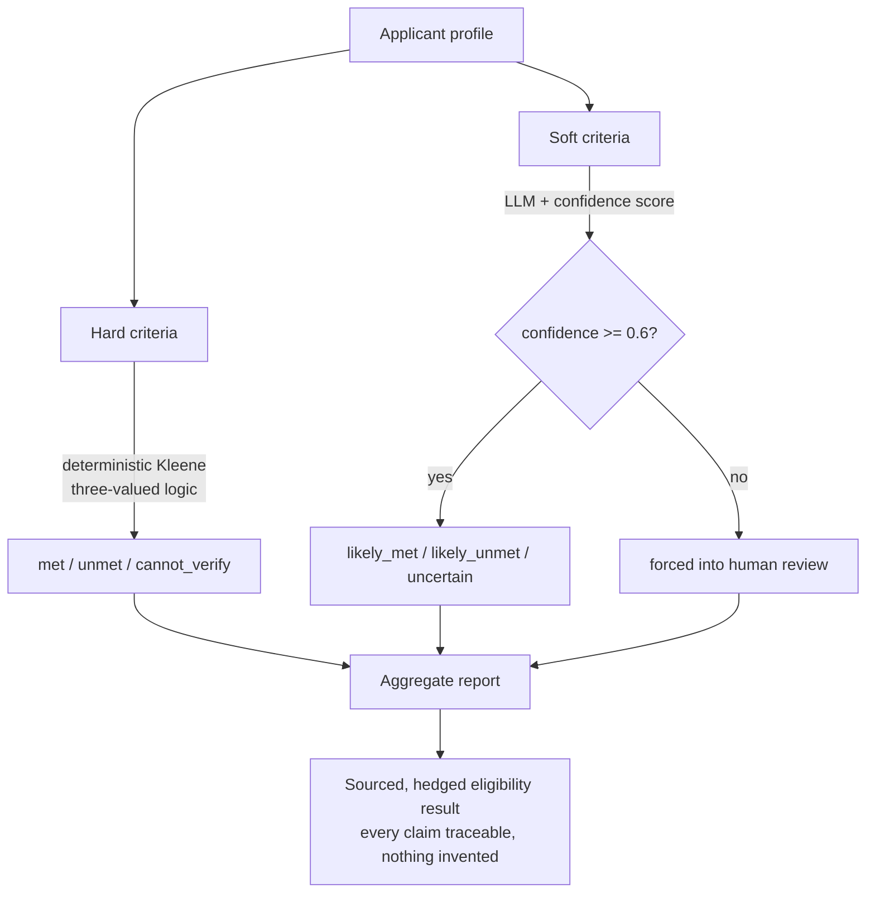
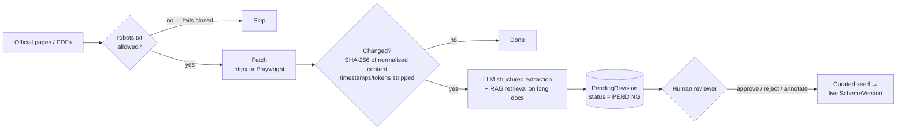

# Bharat OS

Eligibility reasoning and application preparation for Indian government
funding schemes — for startups and MSMEs who don't have a consultant doing
this for them.

Most tools in this space stop at discovery: fill a form, get a match score,
get a link to a government portal. Bharat OS goes further: it tells you
**why** you qualify (or don't), what documents you're missing, drafts your
application with every field labeled by source, and reports honestly on its
own accuracy instead of presenting AI output as fact.

## Live

- **Web app:** https://bharat-os-tawny.vercel.app
- **API:** https://bharat-os-production.up.railway.app (interactive docs at `/docs`)

Open the web app and select **Launch live judge demo** for a one-click
account provisioned with a real profile and real scheme matches.

## What makes this different

- **Deterministic eligibility, not AI guessing.** Hard criteria (turnover
  caps, registration requirements, age limits) run through a real
  three-valued logic engine — met / unmet / **cannot verify**. Missing data
  is never silently treated as a failed check.
- **Every fact is sourced.** Every eligibility criterion carries a real
  government source URL. An unverifiable claim is flagged as such, never
  invented.
- **AI judgments are hedged, not confident-sounding.** Soft/subjective
  criteria go through an LLM with an explicit confidence score and a full
  audit trail (model, prompt version, cache status). Low-confidence
  judgments are forced into human review, not presented as answers.
- **The system reports on its own accuracy.** A live calibration page
  measures whether the AI's stated confidence actually matches real
  outcomes — with an honest warning whenever the underlying data is
  synthetic rather than real.
- **It goes past discovery into execution.** Document-gap analysis, a
  deadline reachability calendar, and an editable draft application with
  per-field provenance (profile-sourced / AI-drafted / needs you) — not
  just a match score and a portal link.
- **It tracks ground truth.** An outcome-intelligence panel aggregates
  de-identified real application outcomes — actual approval rates, actual
  timelines, actual rejection reasons — instead of only republishing what
  a scheme's official notification claims.

## How it works

### User journey



### Eligibility evaluation — deterministic logic meets hedged AI



### Data ingestion — nothing goes live without a human



## Stack

- **Backend:** FastAPI, Python 3.11, SQLAlchemy 2, PostgreSQL (SQLite for
  local dev)
- **Frontend:** Next.js 15, React 19, Tailwind CSS
- **AI:** Provider-neutral LLM adapter (deterministic mock by default,
  Gemini optional)

## Quick start

```bash
# Create databases
sudo -u postgres createuser --createdb "$USER"
sudo -u postgres createdb -O "$USER" bharat_os

# Install
cp .env.example .env
make install
make migrate
make seed

# Run
make dev-backend   # http://localhost:8000
make dev-frontend  # http://localhost:3000
```

Open `http://localhost:3000` and select **Launch live judge demo** for a
one-click provisioned account with real scheme matches, or register a real
account through the normal flow.

## Commands

```
make install        install dependencies
make migrate         run database migrations
make seed             load scheme data
make dev-backend     start API server
make dev-frontend    start frontend
make test             run tests
make lint             run linters
make types            regenerate frontend types from the live API schema
```

## Repository structure

```text
bharat-os/
├── backend/
│   ├── src/bharat_os/
│   │   ├── engine/            # Deterministic Kleene 3-valued rule evaluator (no AI)
│   │   │   ├── evaluator.py       #   met / unmet / cannot_verify + explanations
│   │   │   ├── hard_rules.py  profile.py  results.py
│   │   ├── llm/               # Provider-neutral AI boundary
│   │   │   ├── base.py  mock.py (offline)  gemini.py
│   │   ├── services/          # Application use cases
│   │   │   ├── eligibility.py  ranking.py  deep_dive.py
│   │   │   ├── soft_criteria.py   # hedged LLM judgement + confidence + audit
│   │   │   ├── drafting.py  field_maps.py  documents.py  deadlines.py
│   │   │   ├── outcomes.py        # de-identified outcome capture
│   │   │   ├── calibration.py     # Expected Calibration Error measurement
│   │   │   └── application_lifecycle.py  review_queue.py  notifications.py
│   │   ├── api/               # FastAPI routers (thin HTTP layer)
│   │   │   ├── auth.py  profile.py  matches.py  schemes.py  drafts.py
│   │   │   ├── documents.py  deadlines.py  applications.py
│   │   │   ├── freshness.py  calibration.py  intelligence.py
│   │   │   └── crawler.py  review_queue.py  health.py
│   │   ├── crawler/           # Robots-aware crawler + change detection
│   │   │   ├── runner.py  robots.py  change_detection.py
│   │   │   └── static_fetcher.py  js_fetcher.py (Playwright)  html_text.py
│   │   ├── pdf/               # Extraction + dependency-free RAG retrieval
│   │   │   ├── structured_extraction.py  retrieval.py  pipeline.py
│   │   ├── models/            # SQLAlchemy ORM (schemes, users, drafts, audit...)
│   │   ├── schemas/           # Pydantic request/response contracts
│   │   ├── seed/              # 40-scheme corpus + idempotent loaders
│   │   ├── scripts/           # CLI entrypoints (crawl, calibration, seed...)
│   │   ├── crypto.py          # Fernet field encryption at rest
│   │   ├── security.py        # Argon2 password hashing, session tokens
│   │   └── config.py  db.py  dependencies.py  main.py
│   ├── alembic/               # Database migrations
│   ├── tests/                 # Backend test suite (unit + integration + contract)
│   └── Dockerfile
├── frontend/
│   ├── src/
│   │   ├── app/               # Next.js App Router pages (two visual worlds)
│   │   │   ├── page.tsx           # Landing — "terminal" world
│   │   │   ├── onboarding/  dashboard/  schemes/[slug]/
│   │   │   ├── schemes/[slug]/workspace/   # editable draft application
│   │   │   ├── calibration/  applications/  vault/  deadlines/
│   │   │   └── settings/  review-queue/
│   │   ├── components/        # SchemeCard, CriterionRow, IntelligencePanel...
│   │   └── lib/               # Typed API client + generated OpenAPI types
│   ├── e2e/                   # Playwright browser journeys (CI)
│   └── Dockerfile
├── docs/                      # ARCHITECTURE · API · DEMO_GUIDE · PROJECT_DOCUMENTATION
├── docker-compose.yml         # Local production-like stack
└── Makefile                   # install / migrate / seed / dev / test / lint
```

## Documentation

- [`docs/PROJECT_DOCUMENTATION.md`](docs/PROJECT_DOCUMENTATION.md) — single-page
  overview: architecture, API endpoints, setup, and feature breakdown
- [`docs/ARCHITECTURE.md`](docs/ARCHITECTURE.md) — system design, repository
  map, backend layers, and the two frontend visual systems
- [`docs/API.md`](docs/API.md) — full endpoint reference
- [`docs/DEMO_GUIDE.md`](docs/DEMO_GUIDE.md) — demo setup and what to expect
- [`CHANGELOG.md`](CHANGELOG.md) — what was built and when

## Status

40 seeded schemes, real deterministic + AI-assisted eligibility reasoning,
live calibration and outcome-intelligence measurement, application
workspace with draft generation, document vault, and deadline tracking. All
routes and the full test suite (372 backend, 25 frontend, 4 end-to-end) pass
in CI.

This is an advisory tool, not legal or financial advice. Every draft
requires human review before submission; nothing in this system files an
application on a user's behalf.
