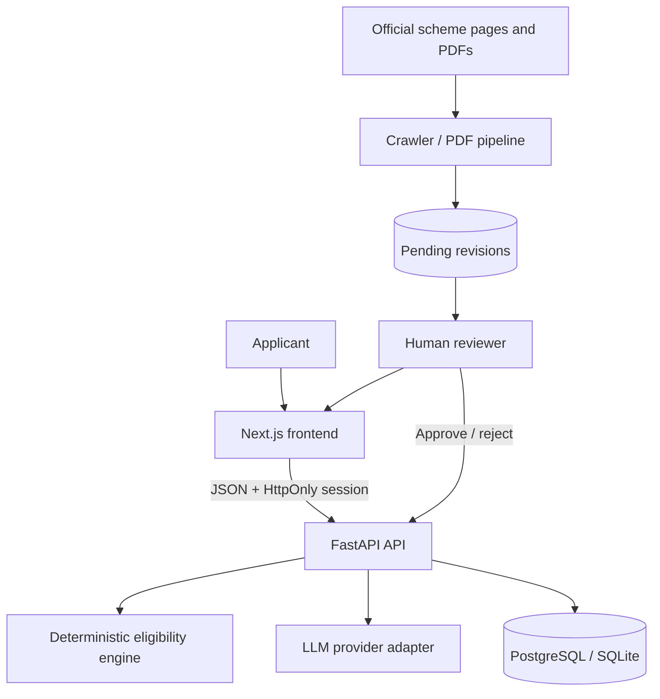

# Architecture

Bharat OS is a modular monolith: a Next.js frontend and a FastAPI backend.
Deterministic eligibility logic is isolated from AI judgement, and AI output
is always hedged with a confidence score and audit trail rather than
presented as fact.

## System context



The browser never talks directly to the database, the LLM provider, or the
crawler. The API owns authentication, consent, rate limiting, and every
response contract.

## Repository map

```text
backend/
  src/bharat_os/
    engine/        Pure hard-rule evaluator (met / unmet / cannot_verify)
    llm/            Provider-neutral AI boundary (mock + Gemini)
    services/       Application use cases (ranking, drafting, outcomes...)
    api/            HTTP routes
    models/ + schemas/  Persistence and wire contracts
    seed/           40-scheme corpus + synthetic outcome seeding
    crawler/ + pdf/ Candidate revision intake, feeds the review queue
frontend/
  src/app/          Next.js App Router pages (two visual worlds — see below)
  src/components/   Shared UI, forms, criterion/document/draft rendering
  src/lib/          API client, generated types, formatting
  e2e/              Playwright browser journeys (CI)
```

## Two frontend visual worlds

The frontend was redesigned mid-hackathon into two deliberately distinct
visual languages, chosen via a structured design-direction process rather
than ad hoc styling:

- **Field system** (`.field-*` classes) — black ground, monospace type,
  hairline rules, one reserved accent color for blocking/alert states.
  Used on every working screen: dashboard, scheme deep-dive, calibration,
  onboarding, settings, review queue, application workspace, vault,
  applications, deadlines. Chosen for Operate-mode surfaces where clarity
  must never be sacrificed for visual flourish.
- **Terminal system** (`.terminal-*` classes) — green-phosphor CRT
  aesthetic, a live typed boot sequence, a falling-digit background, and a
  periodic glitch effect on the headline. Used only on the landing page
  (`/`), the one Persuade-mode surface in the product.

Both worlds render through a shared `AppShell` component that decides,
per-route, whether to wrap a page in the older civic-paper header/footer or
let a redesigned page own its full viewport (`OWN_SHELL_ROUTES` in
`components/AppShell.tsx`).

## Backend layers

### 1. Domain engine

`engine/` evaluates hard eligibility rules against a plain profile object —
no FastAPI, SQLAlchemy, or network imports. Missing data resolves to
`cannot_verify`, never a false disqualification (Kleene three-valued logic).

### 2. AI adapter

`llm/` defines a provider-neutral interface: `MockProvider` (deterministic,
offline) and `GeminiProvider` (real Gemini API, model `gemini-flash-latest`).
`services/soft_criteria.py` owns confidence scoring, the human-review
threshold, and audit persistence — the AI never evaluates hard rules and
never publishes scheme data on its own.

A dependency-free retrieval layer (`pdf/retrieval.py`) chunks and
keyword-scores long documents before extraction, and grounds soft-criteria
judgement in a scheme's own stored text — no vector database or embedding
model, a deliberate choice given the domain's predictable vocabulary.

### 3. Services

Application use cases: ranking (`ranking.py`), deep-dive assembly
(`deep_dive.py`), document matching (`documents.py`), deadline reachability
(`deadlines.py`), draft generation (`drafting.py`), application lifecycle
(`application_lifecycle.py`), outcome de-identification (`outcomes.py`), and
calibration measurement (`calibration.py`).

### 4. API routers

Each router in `api/` is a thin HTTP layer over the services above. Shared
dependencies (`dependencies.py`) enforce session validity, purpose-specific
consent, and reviewer role where required.

## Data integrity invariants

- Every eligibility criterion carries a real `source_url`; an unsourced
  criterion is flagged (`source_quote: null`), never fabricated.
- Sensitive profile fields (exact turnover, social category) are encrypted
  at rest via Fernet; account erasure is a real, tested API endpoint.
- Outcome records are de-identified at capture (turnover banded, no exact
  figures stored) — aggregate accuracy without retaining personal data.
- Synthetic outcome data is marked via a `SYNTHETIC_MARKER` text prefix,
  and `has_real_outcomes` is `true` if even one real outcome exists among
  synthetic ones — real signal is never diluted by synthetic volume.
